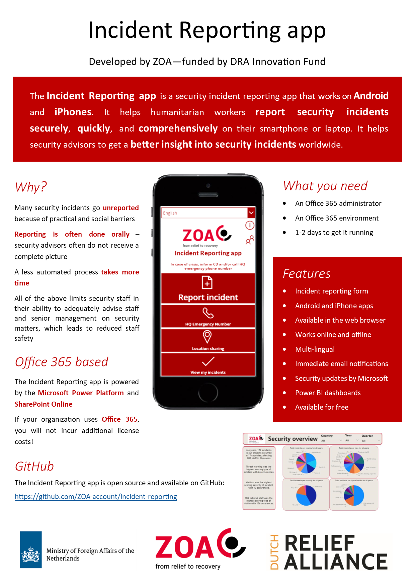

# Incident Reporting

Contents:
1. [Introduction](#Introduction)
1. [One Pager](#One-Pager)
1. [Prerequisites](#Prerequisites)
1. [App features](#App-features)
1. [Before you install](#Before-you-install)
1. [Feedback, feature requests, and questions](#Feedback,-feature-requests,-and-questions)
1. [Other documents](#Other-documents)

  
## One Pager

  
## Introduction
This is an application powered by the [Microsoft Power platform](https://powerplatform.microsoft.com/) and [SharePoint Online](https://products.office.com/en-us/sharepoint/collaboration) that allows users in your environment to report security incidents

The application was built by and for humanitarian nonprofits under the GNU FPLv3 license. This means you are allowed to do almost anything you want with the project, but you are not allowed to distribute closed source versions. For more information about the license of this project, view the license file of this project

This application was made possible through funding from the [Dutch Relief Alliance Innovation Fund (DIF)](https://www.dutchrelief.org/) and the [Dutch Ministry of Foreign Affairs](https://www.government.nl/ministries/ministry-of-foreign-affairs)

This branch of the project is maintained by the IT department of the international relief and recovery organization [ZOA](https://www.zoa-international.com/)

This application is released without warranty, and the author cannot be held liable for any damages inflicted by the application. The author does not provide any official support for this project

  
## Prerequisites

* Office 365  tenant
* User licenses that include at minimum:
    * Power Apps for Office 365
    * Power Automate for Office 365
* SharePoint Online
* Excel
* Google Chrome (Power Apps studio works most reliably on Chrome)

> Note: [Microsoft's licensing plans](https://docs.microsoft.com/en-us/power-platform/admin/powerapps-flow-licensing-faq) may have changed by the time you are reading this. The requirements are minimum requirements; it may be possible to deploy this application if your organisation uses more extensive Power-platform licenses

> Note 2: While [Power Apps does support connections to older SharePoint versions](https://powerapps.microsoft.com/en-us/blog/support-for-sharepoint-on-premises/), the solution was only tested on an SharePoint Online environment

  
## Required admin skills
While this guide is meant to be as detailed as possible to allow anyone with good reading comprehension and admin permissions to deploy the application, it may be helpful to have some experience in the following:
* Administering SharePoint Online
  * Setting up and configuring team sites
  * Setting up and configuring lists
  * Creating SharePoint groups
  * Configuring SharePoint permissions
* Managing Power Apps applications
  * Installing a Power Apps from package
  * Setting up connections to SharePoint
* Managing Power Automate (Flow) automations
  * Installing Power Automate (Flow) from package
  * Setting up connections to SharePoint

> Note: If you want to do advanced configurations of the application, it is advisable to follow the free online [Microsoft Power Platform Fundamentals](https://docs.microsoft.com/en-us/learn/certifications/power-platform-fundamentals) course

  
## App features:
  * Create incident reports (both online and offline)
  * Submit incident reports (online only)
  * View own incident reports (both online and offline)
  * Auto-hide irrelevant questions
  * Switch between languages (online/offline)
  * Ring an emergency number
  * Send a SMS text message with a Google maps location link (in preview)
  * Set up in-app standard operating
precedures  (e.g. "What to do in case of fire...")
  * Viewing submitted incidents (both online and offline)
* Super user features (for security advisors):
  * View all reports
  * Close reports
  * Delete reports
* Administrative features (for IT admins, extends the super user features):
  * Set up special roles for security advisors, IT administrators, and country directors (national management staff)

  
## Before you install

While the application is free to deploy if you are already using the required licenses, there are some important things to consider before deploying

1. This application has no official support channels
1. The Power Platform is a relatively young part of Microsoft 365, and not all aspects of it are mature
1. Making modifications to the application requires specialist knowledge of the Power platform
1. Mid-tier smartphones struggle to render the input form quickly
1. The application was specifically developed for humanitarian NGOs who use Office 365, so be advised that the application may not be suitable for your (commercial) organisation

  
## Feedback, feature requests, and questions

If you have feedback on this project, feel free to [create an issue](#https://gist.github.com/ccannon94/4980dc78456cb7a7ab38028e933cb01e#creating-an-issue) in this repository

  
## Other documents

  * To install the application, read the [installation guide](InstallationGuide.md)
  * For more information about the design of the application, read the [technical documentation](TechnicalDocumentation)